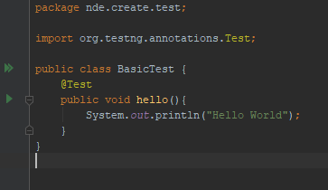
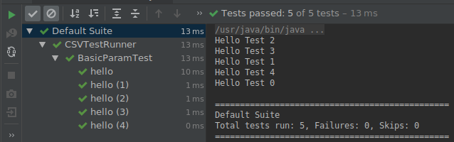

### Using intellij
The project can be implemented without using and an IDE. But I prefer using an IDE since visual aspects provide more insight into development.
I am a fan of Intellij and the IDE integrates really well with TestNG. So Intellij is my default choice in this project.

[Create maven project in intellij](https://www.jetbrains.com/help/idea/maven-support.html#create_new_maven_project)

#### @Test
@Test is the basic annotation for defining test case in TestNG(and in junit). 
You can annotate function with @Test. 

```java
public class BasicTest {
    @Test
    public void hello(){
        System.out.println("Hello World");
    }
}
```
Intellij will show green play button next to 'hello' function. Just click it. 



#### Basic Param Test Array
Going bit forward we will parameterize BasicTest as BasicParamTest and make array of them
```java
public class BasicParamTest {
    private int testId;
    public BasicParamTest(int testId){
        this.testId = testId;
    }
    @Test
    public void hello(){
        System.out.println("Hello Test " + testId);
    }
}
```
Ok. We have parameterized test.  
So how can we run array of them?  
The answer is testNg **@Factory** annotation.

```java
public class BasicParamTestArray {
    @Factory
    public Object[] testArray(){
        int testCount = 5;
        BasicParamTest[] tests = new BasicParamTest[testCount];
        for(int testId = 0; testId < testCount; testId++){
            tests[testId] = new BasicParamTest(testId);
        }

        return tests;
    }
}
```

  
You may see some peculiarities. We will address them later. For now we ran **"Test Array"**.

#### Add Test Array
Next we introduce new test class called AddTest and corresponding AddTestArray class. You can use that to verify add functionality.

```java
public class AddTest {
    private int param1;
    private int param2;
    private int result;

    public AddTest(int param1, int param2, int result){
        this.param1 = param1;
        this.param2 = param2;
        this.result = result;
    }

    @Test
    public void test(){
        Assert.assertEquals(result, param1 + param2);
    }
}
```

```java
public class AddTestArray {
    @Factory
    public Object[] testArray(){
        AddTest[] tests = new AddTest[3];
        tests[0] = new AddTest(3, 4, 7);
        tests[1] = new AddTest(24, 5, 29);
        tests[2] = new AddTest(67, 3, 70);

        return tests;
    }
}
```

#### Loading Tests from CSV
Now it is possible to load tests from a csv.  
It is possible try out few test cases even with failure scenarios.

```java
public class AddTestArrayCSV {
    @Factory
    public Object[] testArray() throws IOException {
        String filePath = "src/main/resources/AddTestBasic.csv";
        try(FileReader fileReader = new FileReader(filePath)){
            CSVReader csvReader = new CSVReader(fileReader);
            
            List<String[]> dataRow = csvReader.readAll();
            
            Object[] addTests = dataRow.stream().map(this::createTest).toArray();
            return addTests;
        }
    }

    private AddTest createTest(String... params){
        int param1 = Integer.parseInt(params[0]);
        int param2 = Integer.parseInt(params[1]);
        int result = Integer.parseInt(params[2]);
        return new AddTest(param1, param2, result);
    }
}
```

Following items are covered in this tutorial
1. Running basic testng test
2. Running tests from an array
3. Loading tests from csv

The error handling logic is intentionally not followed in this tutorial to maintain clarity. Those items will be discussed in next tutorials.
